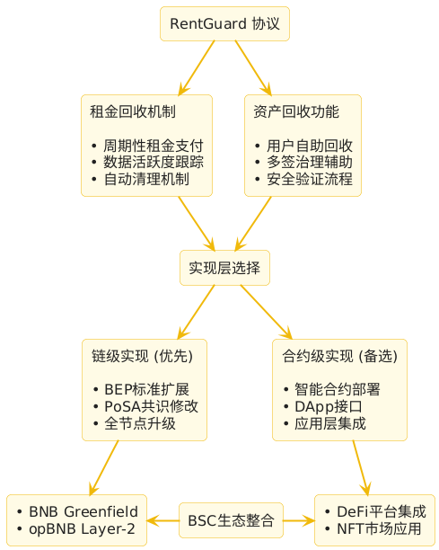
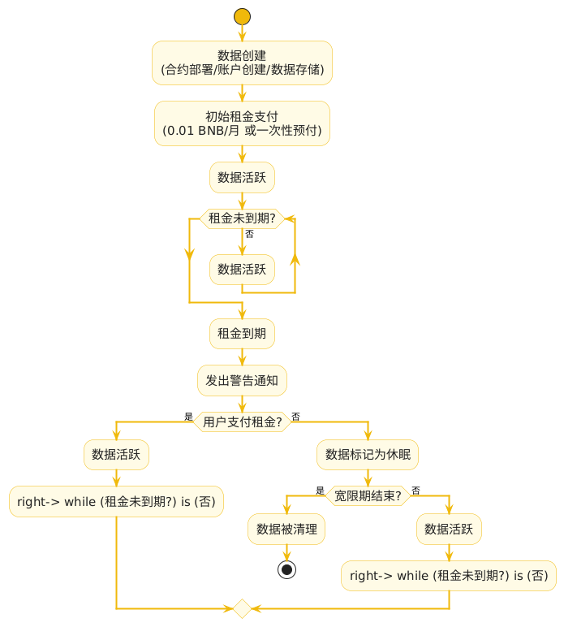
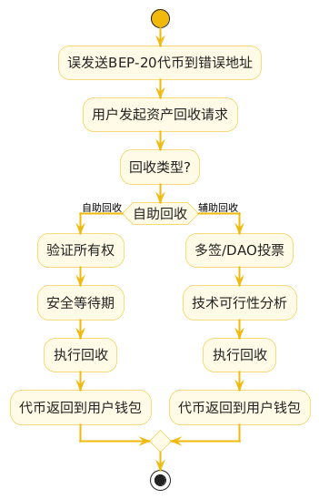
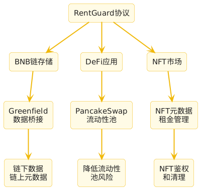

# BNB Chain RentGuard 协议提案

##### 提交至：BNB Chain 社区 / Most Valuable Builder (MVB) 加速器计划 / BNB Chain 治理
##### 日期：2025 年 5 月 20 日
##### 提案名称：RentGuard 协议
##### 提交人： qi
##### 邮箱：devnomadbyte@gmail.com
##### X 账号：@crypto_0xQ

## 1. 提案背景

BNB Smart Chain（BSC）以低 Gas 费用（约 5 Gwei）、高吞吐量（3 秒区块时间）和 EVM 兼容性成为全球领先的区块链平台，2024 年日活跃用户超 100 万，TVL 超 50 亿美元。然而，BSC 生态面临以下挑战：

- **状态膨胀**：链上存储资源（如账户数据、合约状态）随交易增长而膨胀，增加全节点维护成本，威胁长期可持续性。

- **资产丢失**：用户因误操作（如将 BEP-20 代币发送到错误地址）导致资金丢失，2024 年全球加密资产丢失约 10 亿美元，影响用户信任。

- **存储管理缺失**：与 Solana 的租金机制相比，BSC 缺乏链级存储管理，限制了去中心化存储和数据密集型应用的发展。

我提议币安开发 RentGuard 协议，一个基于 BSC 的链级租金回收与资产回收机制，通过智能合约或协议升级实现：

- **租金回收**：用户支付周期性租金（BNB 或 BEP-20 代币）维持链上数据活跃，未支付租金的数据自动清理，优化存储资源。

- **资产回收**：支持用户回收误发送的 BEP-20 代币，提升资金安全。

- **生态整合**：增强 BSC 的 DeFi、NFT 和 Web3 存储生态，吸引亿级用户。

## 2. 提案目标

- **技术目标**：在 BSC 协议层或智能合约层实现租金回收机制，减少状态膨胀，提升链的性能和可持续性。

- **生态目标**：通过资产回收功能增强用户信任，吸引 DeFi、NFT 和存储类用户，6 个月内新增 50 万日活跃用户，贡献 2,000 万美元 TVL。

- **市场目标**：填补 BSC 存储管理空白，与 BNB Greenfield 整合，打造 Web3 存储标杆，抢占 2025 年 50 亿美元存储市场。

- **社区目标**：通过币安的品牌影响力，在 X 和 Discord 推广协议，构建 10 万用户社区。

## 3. 协议设计理念

### 3.1 租金回收机制

**功能**：

- 用户支付租金（建议 0.01 BNB/月或等值 BEP-20 代币）维持链上数据（如账户状态、NFT 元数据、文件哈希）活跃。
- 未支付租金的数据在周期（建议 30 天）后自动清理，释放存储空间。
- 支持"免租"选项：用户预付大额租金（如 2 年费用）豁免周期性支付。

**实现方式**：

- **链级实现（推荐）**：通过 BSC 协议升级（如 BEP 标准），为所有账户引入租金机制，类似 Solana 的 rent-exempt 模型。
- **合约级实现（备选）**：开发通用智能合约（如 RentGuard.sol），供 DApp 调用，管理特定数据存储。

**优势**：

- 减少状态膨胀，降低节点存储成本（当前 BSC 全节点存储约 1 TB）。
- 激励用户清理不活跃数据，提升链效率。

### 3.2 资产回收功能

**功能**：

- 允许用户自助回收误发送的 BEP-20 代币（如发送到无效合约地址）。
- 通过多签或 DAO 治理支持管理员辅助回收，确保去中心化。

**实现方式**：

- **链级**：修改 BSC 协议，添加代币回收接口，类似 EIP-1155 的安全转移功能。
- **合约级**：在智能合约中实现 withdrawTokens（用户自助）和 recoverTokens（多签控制）函数。

**优势**：

- 解决用户误操作痛点，减少每年 10 亿美元的资产丢失。
- 提升 BSC 用户信任，吸引高净值 DeFi 和 NFT 用户。

### 3.3 用户体验

- **DApp 集成**：开发用户友好的前端（参考 PancakeSwap），支持 MetaMask/Trust Wallet，显示租金状态、代币余额和回收选项。
- **通知系统**：通过链下服务（邮件、推送）提醒租金到期，降低用户学习曲线。
- **多语言支持**：提供中英文界面，覆盖全球用户。

## 4. 对 BNB Chain 生态的价值

### 4.1 生态贡献

- **性能优化**：租金机制清理不活跃数据，减少全节点存储需求，提升 BSC 的交易速度（目标亚秒级区块时间）。
- **用户增长**：资产回收功能解决误操作痛点，吸引 DeFi（PancakeSwap 用户）、NFT 和存储类用户，助力 BSC 实现亿级用户目标。
- **TVL 提升**：租金支付激励用户锁定 BNB 和 BEP-20 代币，预计 12 个月内贡献 2,000 万美元 TVL。

**生态整合**：

- 与 BNB Greenfield 结合，链上存储元数据，链下存储原始数据，打造 Web3 存储生态。
- 与 PancakeSwap、Venus 合作，为流动性池或借贷数据引入租金管理。
- 支持 opBNB（Layer-2），降低 Gas 成本，扩展存储类应用。

### 4.2 市场竞争力

| 链 | 存储管理 | 资产回收 | BSC RentGuard 优势 |
|---|---|---|---|
| Solana | 链级租金机制 | 无 | EVM 兼容，低 Gas 费用，资产回收 |
| Ethereum | 无（高 Gas 成本） | 部分工具（如 EIP-1155） | 低成本，通用存储管理 |
| BSC 当前 | 无 | 依赖第三方（如 Coinbase） | 链级/合约级实现，去中心化 |

**差异化优势**：RentGuard 结合租金管理和资产回收，适配 BSC 的低成本和高吞吐量特性，填补存储管理空白。

### 4.3 用户痛点解决

- **高存储成本**：租金机制（0.01 BNB/月）比传统 Gas 模型更可预测，降低长期存储费用。
- **资产丢失**：去中心化回收功能防止代币因误操作锁定，优于中心化工具（如 Coinbase）。
- **复杂操作**：DApp 提供直观界面，租金到期提醒，降低使用门槛。

## 5. 实施建议

### 5.1 币安的实施路径

我建议币安团队以以下方式实现 RentGuard 协议：

**链级实现（优先）**：

- 通过 BEP 标准（如 BEP-20 扩展）引入链级租金机制，适用于所有 BSC 账户。
- 修改 PoSA 共识，添加存储费用和清理逻辑，参考 Solana 的 rent-exempt 模型。
- 开发资产回收接口，集成到 BSC 核心协议，支持代币安全转移。

**合约级实现（备选）**：

- 开发通用智能合约（如 RentGuard.sol），开源供 DApp 使用。
- 提供标准接口（Solidity），支持 NFT、DeFi 和存储类应用。

**DApp 开发**：

- 开发官方 DApp（基于 React/Web3.js），集成 MetaMask，提供租金支付、数据存储和资产回收功能。
- 与 PancakeSwap 合作，嵌入租金管理模块，增强用户体验。

**生态整合**：

- 与 BNB Greenfield 桥接，链上存储元数据，链下存储数据。
- 支持 opBNB，降低 Gas 成本，扩展 Layer-2 应用场景。

**安全保障**：

- 与 Certik、PeckShield 合作，审计合约或协议代码。
- 使用多签或 DAO 管理资产回收，减少中心化风险。

## 6. 对币安的请求

本提案是一个概念性建议，作为个人开发者，我不会参与实际开发，而是希望币安基于其技术实力和生态系统优势来实现此协议。我请求 BNB Chain 团队：

- **采纳提案**：将 RentGuard 纳入 BSC 技术路线图，优先考虑链级实现。
- **技术开发**：由币安开发者团队实现协议和 DApp，整合 BNB Greenfield 和 opBNB。
- **社区推广**：在 DappBay 推荐协议，通过 X 和 Discord 宣传，吸引用户和开发者。
- **治理反馈**：通过 Tally 平台或 BNB Chain 治理流程，组织社区讨论，完善协议设计。

## 7. 结论

RentGuard 协议通过租金回收和资产回收功能，为 BSC 生态带来以下价值：

- **技术创新**：填补存储管理空白，减少状态膨胀，提升链性能。
- **用户信任**：解决资产丢失痛点，吸引 DeFi、NFT 和存储用户。
- **生态增长**：预计新增 50 万日活跃用户，2,000 万美元 TVL，助力 BSC 亿级用户目标。
- **市场竞争力**：结合 BNB Greenfield，打造 Web3 存储标杆，抢占 50 亿美元市场。

我相信，币安的品牌影响力和技术实力能够快速实现 RentGuard，增强 BSC 在全球区块链生态的领导地位。本提案仅提供概念和设计思路，具体实现完全由币安团队负责。

## 参考资料

- Solana 租金机制：https://docs.solana.com/developing/programming-model/accounts#rent
- BNB Chain 代币回收 DApp：https://www.bnbchain.org/en/token-recovery 
