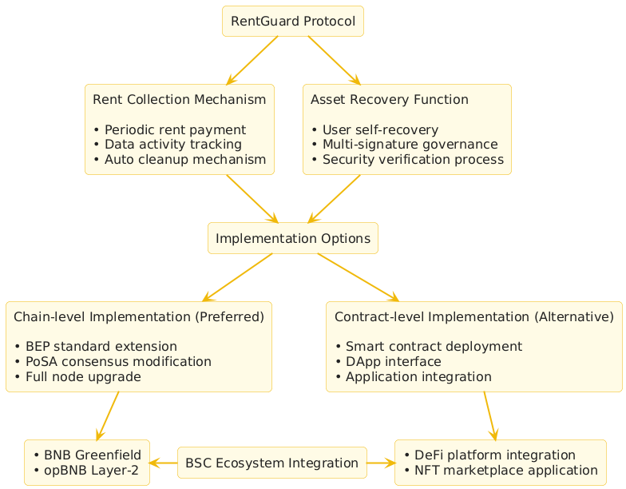
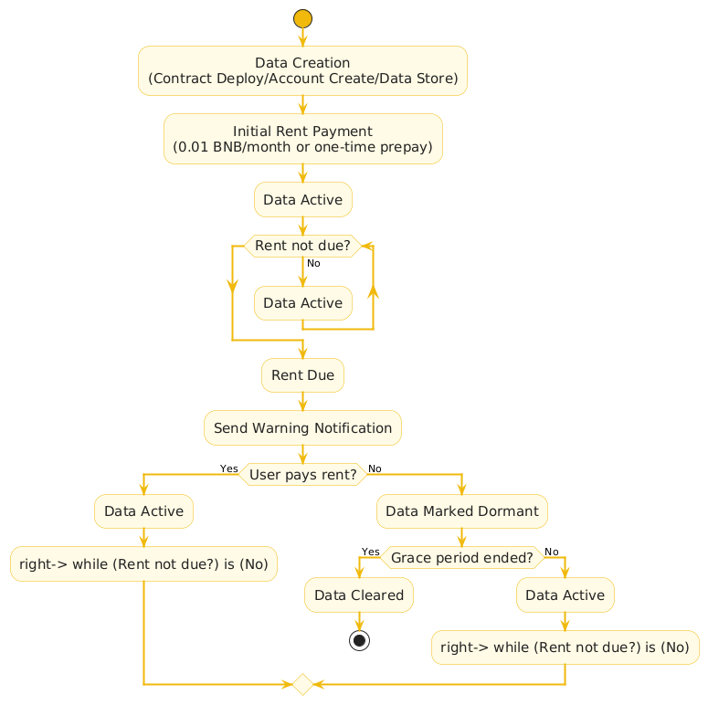
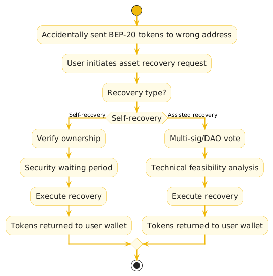
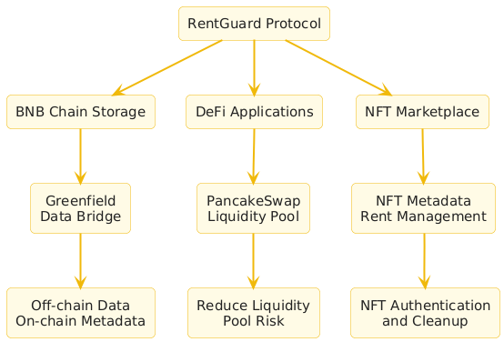

# BNB Chain RentGuard Protocol Proposal

Submitted to: BNB Chain Community / Most Valuable Builder (MVB) Accelerator Program / BNB Chain Governance
Date: May 20, 2025
Proposal Name: RentGuard Protocol
Submitted by: qi
Email: devnomadbyte@gmail.com

X:  @crypto_0xQ

## 1. Background

BNB Smart Chain (BSC) has become a leading blockchain platform with low gas fees (approximately 5 Gwei), high throughput (3-second block time), and EVM compatibility. In 2024, BSC achieved over 1 million daily active users and a TVL exceeding $5 billion. However, the BSC ecosystem faces several challenges:

- **State Bloat**: On-chain storage resources (such as account data and contract states) expand with transaction growth, increasing full node maintenance costs and threatening long-term sustainability.

- **Asset Loss**: Users lose funds due to operational errors (like sending BEP-20 tokens to incorrect addresses). In 2024, approximately $1 billion in crypto assets were lost globally, affecting user trust.

- **Lack of Storage Management**: Unlike Solana's rent mechanism, BSC lacks chain-level storage management, limiting the development of decentralized storage and data-intensive applications.

I propose that Binance develop the RentGuard protocol, a BSC-based chain-level rent collection and asset recovery mechanism, implemented through smart contracts or protocol upgrades:

- **Rent Collection**: Users pay periodic rent (in BNB or BEP-20 tokens) to maintain active on-chain data. Data without paid rent is automatically cleared, optimizing storage resources.

- **Asset Recovery**: Support for users to recover mistakenly sent BEP-20 tokens, enhancing fund security.

- **Ecosystem Integration**: Enhance BSC's DeFi, NFT, and Web3 storage ecosystem, attracting hundreds of millions of users.

## 2. Proposal Objectives

- **Technical Objective**: Implement a rent collection mechanism at the BSC protocol or smart contract layer to reduce state bloat and improve chain performance and sustainability.

- **Ecosystem Objective**: Enhance user trust through asset recovery functionality, attracting DeFi, NFT, and storage users. Add 500,000 daily active users and contribute $20 million TVL within 6 months.

- **Market Objective**: Fill the BSC storage management gap, integrate with BNB Greenfield, create a Web3 storage benchmark, and capture a share of the $5 billion storage market in 2025.

- **Community Objective**: Leverage Binance's brand influence to promote the protocol on X and Discord, building a community of 100,000 users.

## 3. Protocol Design Philosophy

### 3.1 Rent Collection Mechanism

**Features**:

- Users pay rent (suggested 0.01 BNB/month or equivalent BEP-20 tokens) to maintain active on-chain data (such as account states, NFT metadata, file hashes).
- Unpaid data is automatically cleared after a period (suggested 30 days), freeing up storage space.
- "Rent-exempt" option: Users can prepay a large amount of rent (e.g., 2 years of fees) to exempt from periodic payments.

### 3.2 Asset Recovery Functionality

**Features**:

- Allow users to self-recover mistakenly sent BEP-20 tokens (such as those sent to invalid contract addresses).
- Support administrator-assisted recovery through multi-signature or DAO governance, ensuring decentralization.

**Implementation Methods**:

- **Chain-level**: Modify the BSC protocol, adding a token recovery interface similar to EIP-1155's safe transfer functionality.
- **Contract-level**: Implement withdrawTokens (user self-help) and recoverTokens (multi-signature controlled) functions in smart contracts.

**Advantages**:

- Address user operational pain points, reducing annual asset loss of $1 billion.
- Enhance BSC user trust, attracting high-net-worth DeFi and NFT users.

### 3.3 User Experience

- **DApp Integration**: Develop a user-friendly frontend (referencing PancakeSwap), supporting MetaMask/Trust Wallet, displaying rent status, token balances, and recovery options.
- **Notification System**: Remind users of rent expiration through off-chain services (email, push notifications), reducing the learning curve.
- **Multi-language Support**: Provide interfaces in Chinese and English, covering global users.

## 4. Value to the BNB Chain Ecosystem

### 4.1 Ecosystem Contributions

- **Performance Optimization**: The rent mechanism clears inactive data, reducing full node storage requirements and improving BSC transaction speed (targeting sub-second block times).
- **User Growth**: Asset recovery functionality solves operational pain points, attracting DeFi (PancakeSwap users), NFT, and storage users, helping BSC achieve its goal of hundreds of millions of users.
- **TVL Increase**: Rent payments incentivize users to lock BNB and BEP-20 tokens, expected to contribute $20 million TVL within 12 months.

**Ecosystem Integration**:

- Combine with BNB Greenfield, storing metadata on-chain and original data off-chain, creating a Web3 storage ecosystem.
- Collaborate with PancakeSwap and Venus to introduce rent management for liquidity pools or lending data.
- Support opBNB (Layer-2), reducing Gas costs and expanding storage application scenarios.

### 4.2 Market Competitiveness

| Chain | Storage Management | Asset Recovery | BSC RentGuard Advantages |
|---|---|---|---|
| Solana | Chain-level rent mechanism | None | EVM compatibility, low Gas fees, asset recovery |
| Ethereum | None (high Gas costs) | Partial tools (like EIP-1155) | Low cost, universal storage management |
| BSC Current | None | Relies on third parties (like Coinbase) | Chain/contract-level implementation, decentralized |

**Differentiation Advantage**: RentGuard combines rent management and asset recovery, adapting to BSC's low-cost and high-throughput characteristics, filling the storage management gap.

### 4.3 Solving User Pain Points

- **High Storage Costs**: The rent mechanism (0.01 BNB/month) is more predictable than the traditional Gas model, reducing long-term storage costs.
- **Asset Loss**: Decentralized recovery functionality prevents tokens from being locked due to operational errors, superior to centralized tools (like Coinbase).
- **Complex Operations**: DApp provides an intuitive interface, rent expiration reminders, lowering usage barriers.

## 5. Implementation Suggestions

### 5.1 Binance's Implementation Path

I suggest the Binance team implement the RentGuard protocol as follows:

**Chain-level Implementation (Priority)**:

- Introduce a chain-level rent mechanism through BEP standards (such as BEP-20 extension), applicable to all BSC accounts.
- Modify PoSA consensus, adding storage fee and cleanup logic, referencing Solana's rent-exempt model.
- Develop asset recovery interfaces, integrated into the BSC core protocol, supporting secure token transfers.

**Contract-level Implementation (Alternative)**:

- Develop a universal smart contract (such as RentGuard.sol), open-source for DApp use.
- Provide standard interfaces (Solidity), supporting NFT, DeFi, and storage applications.

**DApp Development**:

- Develop an official DApp (based on React/Web3.js), integrating MetaMask, providing rent payment, data storage, and asset recovery functionality.
- Collaborate with PancakeSwap to embed a rent management module, enhancing user experience.

**Ecosystem Integration**:

- Bridge with BNB Greenfield, storing metadata on-chain and data off-chain.
- Support opBNB, reducing Gas costs, expanding Layer-2 application scenarios.

**Security Assurance**:

- Collaborate with Certik and PeckShield to audit contract or protocol code.
- Use multi-signature or DAO to manage asset recovery, reducing centralization risks.

## 6. Request to Binance

This proposal is a conceptual suggestion. As an individual developer, I will not participate in the actual development but rather hope that Binance will implement this protocol based on its technical strength and ecosystem advantages. I request the BNB Chain team to:

- **Adopt the Proposal**: Include RentGuard in BSC's technical roadmap, prioritizing chain-level implementation.
- **Technical Development**: Have Binance's developer team implement the protocol and DApp, integrating BNB Greenfield and opBNB.
- **Community Promotion**: Recommend the protocol on DappBay, promote through X and Discord, attracting users and developers.
- **Governance Feedback**: Organize community discussions through the Tally platform or BNB Chain governance process to refine the protocol design.

## 7. Conclusion

The RentGuard protocol, through rent collection and asset recovery functionality, brings the following value to the BSC ecosystem:

- **Technical Innovation**: Fill the storage management gap, reduce state bloat, improve chain performance.
- **User Trust**: Solve asset loss pain points, attract DeFi, NFT, and storage users.
- **Ecosystem Growth**: Expected to add 500,000 daily active users and $20 million TVL, helping BSC achieve its goal of hundreds of millions of users.
- **Market Competitiveness**: Combined with BNB Greenfield, create a Web3 storage benchmark, capturing a share of the $5 billion market.

I believe that Binance's brand influence and technical capabilities can quickly implement RentGuard, enhancing BSC's leadership position in the global blockchain ecosystem. This proposal only provides concepts and design ideas, with the specific implementation entirely the responsibility of the Binance team.

## References

- Solana Rent Mechanism: https://docs.solana.com/developing/programming-model/accounts#rent
- BNB Chain Token Recovery DApp: https://www.bnbchain.org/en/token-recovery 
